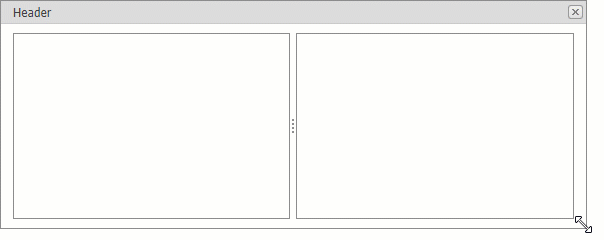

<!-- default badges list -->

[](https://supportcenter.devexpress.com/ticket/details/E3559)
[](https://docs.devexpress.com/GeneralInformation/403183)
<!-- default badges end -->

# Popup Control for ASP.NET Web Forms - How to resize control content (Splitter) when resizing the popup
<!-- run online -->
**[[Run Online]](https://codecentral.devexpress.com/e3559/)**
<!-- run online end -->

This example demonstrates how to resize the nested [ASPxSplitter](https://docs.devexpress.com/AspNet/DevExpress.Web.ASPxSplitter) control when the [ASPxPopupControl](https://docs.devexpress.com/AspNet/DevExpress.Web.ASPxPopupControl) is resized.



The [ASPxPopupControl](https://docs.devexpress.com/AspNet/DevExpress.Web.ASPxPopupControl) does not have a built-in capability to resize nested controls when it is resized. This example illustrates how to automatically resize control places inside a popup. 

To accomplish this task, execute the following steps:

1. Set the [ASPxPopupControl.ScrollBars](https://docs.devexpress.com/AspNet/DevExpress.Web.ASPxPopupControlBase.ScrollBars) property to `Auto`. This option allows the popup control to evaluate content width and height.
    ```html
    <dx:ASPxPopupControl ID="ASPxPopupControl1" runat="server" Height="500px" Width="500px" 
                         ScrollBars="Auto" AllowResize="true" LoadContentViaCallback="OnFirstShow">
        ...
    </dx:ASPxPopupControl>
    ```
2. Handle the [ASPxClientPopupControl.AfterResizing](https://docs.devexpress.com/AspNet/js-ASPxClientPopupControlBase.AfterResizing) event. In the event handler, call the [AdjustControl](https://docs.devexpress.com/AspNet/js-ASPxClientControl.AdjustControl) method for a nested control to force the control to reevaluate its size.
    ```js
    function OnAfterResizing() {
        splitter.AdjustControl();
    }
    ```
3. Place the nested control into the `div` element with the following style. This element is necessary to overcome scrollbars that can be shown when `ScrollBars="Auto"` is set.
    ```html
    <div style="height: 100%; width: 100%; overflow: hidden">
        <dx:ASPxSplitter ID="ASPxSplitter" runat="server" Width="100%" Height="100%" ClientInstanceName="splitter">
            ...
        </dx:ASPxSplitter>
    </div>
    ```

## Files to Review

* [Default.aspx](./CS/WebSite/Default.aspx) (VB: [Default.aspx](./VB/WebSite/Default.aspx))
